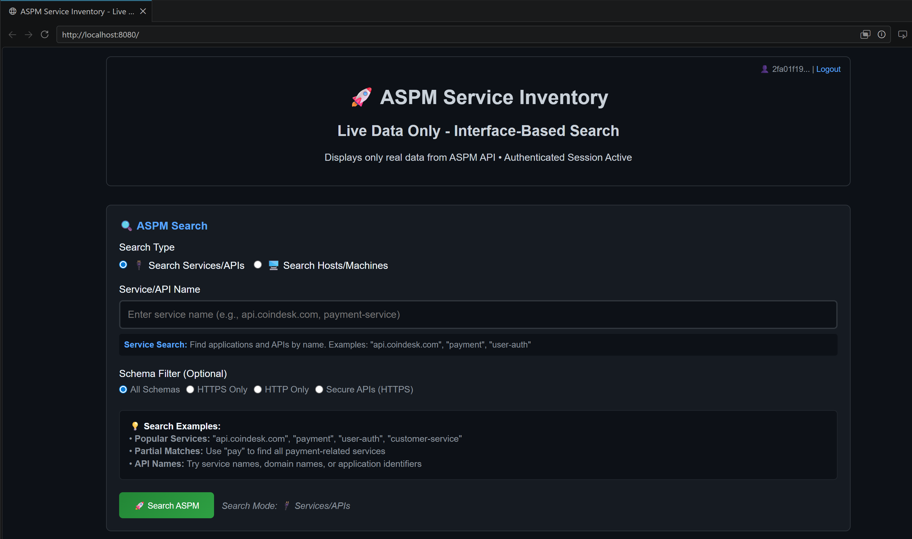

# 🔍 ASPM Service Inventory with ServiceNow Integration

A comprehensive web application for discovering and managing services using the CrowdStrike ASPM API, with enhanced ServiceNow integration capabilities.

## ✨ Enhanced Features

### 🎯 **Core Functionality**
- **Service Discovery**: Search services by hostname and platform
- **Host-to-Service Mapping**: Find which services are deployed on hosts
- **Real-time Data**: Live integration with CrowdStrike ASPM API
- **Secure Authentication**: OAuth2-based CrowdStrike authentication
- **Web Interface**: Modern, responsive interface for service exploration
- **ServiceNow Integration**: Export service data in ServiceNow-compatible formats

### 🚀 **ServiceNow Integration (NEW)**
- **📋 JSON Export**: 6 different ServiceNow-compatible export formats
- **🏠 Host Integration**: Complete host data with ASMP-discovered applications
- **📊 Service Integration**: Service CMDB CI, Incident, and Integration formats
- **🔄 Real-time Data**: No mock data - all live from CrowdStrike APIs
- **📈 Comprehensive Data**: "More data is better" - maximum detail in exports

## 🚀 Deployment Options

### Option 1: Enhanced ServiceNow Version (Latest)

```bash
# Enhanced version with ServiceNow integration
docker run -d \
  --name aspm-servicenow-inventory \
  -p 8080:8080 \
  -e CROWDSTRIKE_CLIENT_ID="your_client_id" \
  -e CROWDSTRIKE_CLIENT_SECRET="your_client_secret" \
  ghcr.io/mikedzikowski/aspm-api-inventory:v1.1.0-servicenow
```

**Features**: Complete host + service data, 6 ServiceNow export formats, real-time ASPM application discovery
**Access**: <http://localhost:8080>

### Option 2: Standard Version

```bash
# Standard service discovery version
docker run -d \
  --name aspm-service-inventory \
  -p 8080:8080 \
  -e CROWDSTRIKE_CLIENT_ID="your_client_id" \
  -e CROWDSTRIKE_CLIENT_SECRET="your_client_secret" \
  ghcr.io/mikedzikowski/aspm-api-inventory:v1.0.3
```

**Access**: <http://localhost:8080>

### Option 3: Local Development

```bash
# Clone repository
git clone https://github.com/mikedzikowski/cs-aspm-api-inventory-gui.git
cd cs-aspm-api-inventory-gui

# Build and run
docker build -f Dockerfile.secure -t aspm-inventory .
docker run -d \
  --name aspm-service-inventory \
  -p 8080:8080 \
  -e CROWDSTRIKE_CLIENT_ID="your_client_id" \
  -e CROWDSTRIKE_CLIENT_SECRET="your_client_secret" \
  aspm-inventory
```

**Access**: <http://localhost:8080>

### Option 3: Direct Python Execution

```bash
# Clone repository
git clone https://github.com/mikedzikowski/cs-aspm-api-inventory-gui.git
cd cs-aspm-api-inventory-gui

# Install dependencies
pip install -r requirements.txt

# Run application (with enhanced ServiceNow features)
PORT=8080 \
CROWDSTRIKE_CLIENT_ID="your_client_id" \
CROWDSTRIKE_CLIENT_SECRET="your_client_secret" \
python3 live_data_server_enhanced_with_servicenow.py
```

**Access**: <http://localhost:8080>

### Option 4: Environment File Configuration

```bash
# Clone repository
git clone https://github.com/mikedzikowski/cs-aspm-api-inventory-gui.git
cd cs-aspm-api-inventory-gui

# Create environment file
cp .env.example .env

# Edit .env with your credentials
nano .env
```

**.env file:**

```env
CROWDSTRIKE_CLIENT_ID=your_client_id_here
CROWDSTRIKE_CLIENT_SECRET=your_client_secret_here
PORT=8080
FLASK_ENV=production
```

```bash
# Run with environment file
python3 live_data_server_enhanced_with_servicenow.py
```

## 🔧 Configuration

### Required Environment Variables

| Variable | Description | Required |
|----------|-------------|----------|
| `CROWDSTRIKE_CLIENT_ID` | Your CrowdStrike API Client ID | Yes |
| `CROWDSTRIKE_CLIENT_SECRET` | Your CrowdStrike API Client Secret | Yes |
| `PORT` | Application port (default: 8080) | No |
| `FLASK_ENV` | Flask environment (production/development) | No |

### Custom Port Configuration

```bash
# Run on different port
PORT=9000 CROWDSTRIKE_CLIENT_ID="..." python3 live_data_server_enhanced_with_servicenow.py

# Docker with custom port
docker run -d -p 9000:9000 -e PORT=9000 -e CROWDSTRIKE_CLIENT_ID="..." aspm-inventory
```

## 🌐 Usage



*Modern, responsive web interface for CrowdStrike ASPM service discovery and ServiceNow integration*

1. **Access Application**: Open http://localhost:8080 (or your custom port)
2. **Service Search**:
   - Use the "Search Services" tab
   - Enter service name for discovery
   - View deployment details and metadata
3. **Host Details**:
   - Use the "Host Details" tab
   - Enter hostname to find deployed services
   - View service-to-host mappings
4. **ServiceNow Export**:
   - Export service data in ServiceNow CMDB CI format
   - Generate incident tickets with service context
   - Create integration payloads with host details

## 🔐 Security Features

- ✅ No hardcoded credentials (environment variable based)
- ✅ OAuth2 authentication with CrowdStrike
- ✅ Non-root container execution
- ✅ Health check monitoring
- ✅ Certificate-free Docker builds

## 🐛 Troubleshooting

### Authentication Issues
```bash
# Verify credentials are set
echo $CROWDSTRIKE_CLIENT_ID

# Test application health
curl http://localhost:8080/
```

### Port Already in Use
```bash
# Use different port
PORT=8181 python3 live_data_server_enhanced_with_servicenow.py
```

### Docker Issues
```bash
# Clean Docker environment
docker system prune -f
docker build --no-cache -f Dockerfile.secure -t aspm-inventory .
```

## 📋 API Endpoints

| Endpoint | Method | Description |
|----------|--------|-------------|
| `/` | GET | Web interface |
| `/login` | POST | Authentication |
| `/api/aspm/query` | POST | Service search |
| `/api/asmp/host-details` | POST | Host-to-service mapping |
| `/api/servicenow/export/service` | POST | ServiceNow CMDB CI export |
| `/api/servicenow/export/incident` | POST | ServiceNow incident export |
| `/api/servicenow/export/integration` | POST | ServiceNow integration export |

## 📊 ServiceNow Export Examples

The application provides comprehensive ServiceNow integration with multiple export formats. All exports include live data from CrowdStrike ASPM APIs with no mock data.

### 🏠 **Host CMDB CI Export** (Recommended)

Complete host configuration item export with discovered applications and API endpoints:

```json
{
  "name": "example-host-01",
  "ci_class": "cmdb_ci_computer",
  "operational_status": "1",
  "sys_class_name": "cmdb_ci_computer",
  "short_description": "CrowdStrike managed host: example-host-01",
  "discovery_source": "CrowdStrike Falcon",
  "ip_address": "192.168.1.100",
  "host_name": "example-host-01",
  "dns_domain": "example.com",
  "os": "Ubuntu 22.04 LTS",
  "os_version": "Ubuntu 22.04 LTS",
  "manufacturer": "Dell Inc.",
  "mac_address": "00-1B-44-11-3A-B7",
  "u_external_ip": "203.0.113.100",
  "u_platform_name": "Linux",
  "u_agent_version": "7.XX.XXXXX.0",
  "u_last_seen": 1640995200000,
  "u_first_seen": 1640908800000,
  "u_deployment_id": 123456789012,
  "u_host_type": "Machine",
  "u_host_status": "normal",
  "u_bios_version": "2.18.0",
  "u_deployed_applications": [
    {
      "name": "web-application-service",
      "service_id": 100000000001,
      "technology": "NodeJS",
      "service_type": "Application",
      "endpoints_count": 12,
      "sample_endpoints": [
        {
          "path": "/api/users",
          "method": "GET",
          "type": "HTTP",
          "technology": "REST",
          "interface_id": 200000000001
        },
        {
          "path": "/api/auth/login",
          "method": "POST",
          "type": "HTTP",
          "technology": "REST",
          "interface_id": 200000000003
        }
      ]
    },
    {
      "name": "database-service",
      "service_id": 100000000002,
      "technology": "Python",
      "service_type": "Database",
      "endpoints_count": 8,
      "sample_endpoints": [
        {
          "path": "/api/query",
          "method": "POST",
          "type": "HTTP",
          "technology": "REST",
          "interface_id": 200000000010
        },
        {
          "path": "/api/metrics",
          "method": "GET",
          "type": "HTTP",
          "technology": "REST",
          "interface_id": 200000000012
        }
      ]
    }
  ],
  "u_deployed_applications_count": 3,
  "u_deployed_applications_names": "web-application-service, database-service, monitoring-service"
}
```

### 📋 **Available Export Formats**

1. **Host CMDB CI Export** - Complete host details with applications (recommended)
2. **Service CMDB CI Export** - Individual service configuration items
3. **Incident Export** - ServiceNow incident creation format
4. **Integration Export** - Custom integration payload format
5. **Service Details Export** - Detailed service metadata
6. **Host Details Export** - Extended host information

### 🔄 **Usage Instructions**

1. **Access Application**: http://localhost:8080
2. **Login**: Use your CrowdStrike API credentials
3. **Search**: Find hosts or services using the search tabs
4. **Export**: Click "Export to ServiceNow" buttons for different formats
5. **Integration**: Import JSON directly into ServiceNow CMDB

**Complete example JSON**: See `example.json` in the repository for the full export structure.

## 📄 Version Information

- **Version**: 1.0.3
- **Release Date**: 2026-05-18
- **Compatibility**: CrowdStrike ASPM API
- **Container Registry**: ghcr.io/mikedzikowski/aspm-api-inventory

## 🤝 Support

- **Repository**: https://github.com/mikedzikowski/cs-aspm-api-inventory-gui
- **Issues**: Report via GitHub Issues
- **Container Registry**: GitHub Container Registry (GHCR)

## 🎯 Quick Reference

**One-liner deployment:**
```bash
docker run -d --name aspm-inventory -p 8080:8080 -e CROWDSTRIKE_CLIENT_ID="xxx" -e CROWDSTRIKE_CLIENT_SECRET="yyy" ghcr.io/mikedzikowski/aspm-api-inventory:v1.0.3
```

**Local development:**
```bash
git clone https://github.com/mikedzikowski/cs-aspm-api-inventory-gui.git && cd cs-aspm-api-inventory-gui && pip install -r requirements.txt
```

**Health check:**
```bash
curl http://localhost:8080/
```